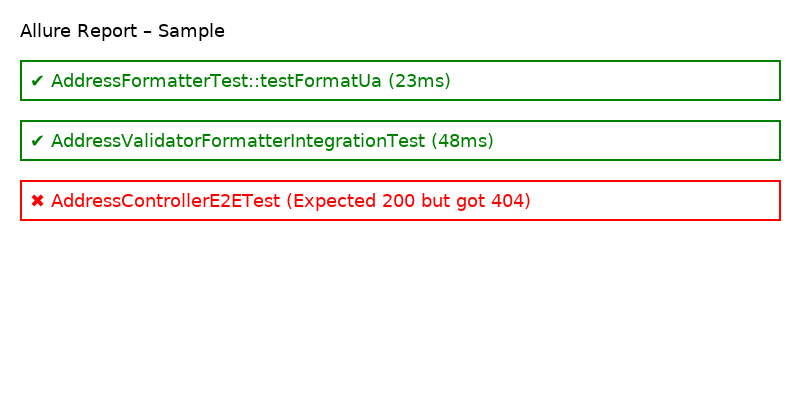

## Installation

Install via Composer:

```bash
composer require your-org/address-engine
```


# Address Component

[](https://github.com/your-username/your-repo/actions/workflows/tests.yml)
[](https://codecov.io/gh/your-username/your-repo)

## Описание
Коммерческий Address-компонент:
- Entity + Repository + Service + DTO/ResponseDTO
- Engine (Country/Subdivision/Format/Validator)
- Полный набор тестов (unit, integration, functional, e2e)
- GitHub Actions CI + Code Coverage

## Запуск тестов
```bash
vendor/bin/phpunit --coverage-html build/coverage-html
```

## CI/CD
- Автоматические тесты и coverage при каждом push/PR.
- Статусы видны в бейджах выше.


## QA & Reports

### PHPUnit
Запуск юнит, интеграционных, функциональных и e2e тестов:
```bash
vendor/bin/phpunit --coverage-html build/coverage-html
```

### Behat (BDD)
Запуск бизнес-сценариев:
```bash
vendor/bin/behat --strict --no-interaction
```

### Allure Reports
1. Запустить тесты (PHPUnit и Behat), чтобы сформировались результаты в `build/allure-results`.
2. Поднять Allure Report локально:
```bash
docker-compose -f docker-compose.allure.yml up --build
```
3. Открыть в браузере: [http://localhost:8080](http://localhost:8080)

### CI/CD
- GitHub Actions и GitLab CI автоматически собирают тесты и выгружают результаты Allure.


### Demo Allure Report
Пример отчёта доступен локально: [docs/allure-sample/index.html](docs/allure-sample/index.html)  



## Quality & Coverage

[](https://sonarcloud.io/dashboard?id=address_engine)
[](https://sonarcloud.io/dashboard?id=address_engine)
[](https://sonarcloud.io/dashboard?id=address_engine)
[](https://sonarcloud.io/dashboard?id=address_engine)


## Static Analysis

[](https://github.com/your-org/address_engine/actions/workflows/static-analysis.yml)
[](https://github.com/your-org/address_engine/actions/workflows/static-analysis.yml)
[](https://github.com/your-org/address_engine/network/updates)


### Static Analysis Reports Demo
- [PHPStan Sample](docs/static-analysis-sample/phpstan-sample.html)
- [Psalm Sample](docs/static-analysis-sample/psalm-sample.html)


## Dev Workflow

### Pre-commit Hooks
В проекте настроены pre-commit проверки:
- ✅ Lint PHP файлов
- ✅ PHPStan (strict mode)
- ✅ Psalm (static analysis)
- ✅ PHPUnit (unit/integration tests)

Хуки можно запускать вручную:
```bash
composer lint
composer phpstan
composer psalm
composer test
```
